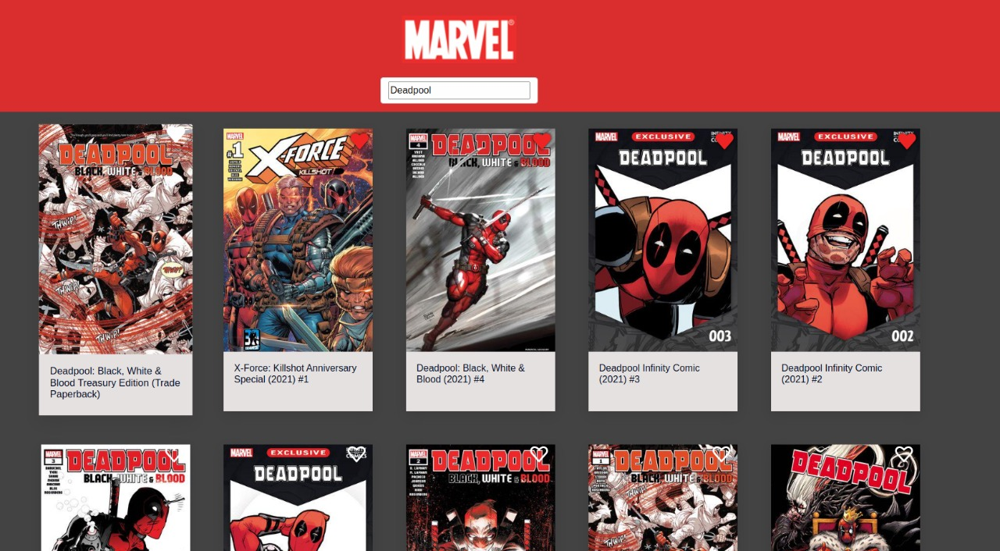

# Marvel Comics 

### Description

Using the Marvel developer API ​ https://developer.marvel.com/​ , create a simple app that allows
the user to scroll through all the comics ever released from the most recent to the oldest (and
please, let us see the cover picture while at it!). The app should allow users to search by
character (eg. ​ deadpool ​ ) and allow the user to mark specific comics as favourites.
The assets to recreate the design can be found inside the `assets` folder.

### Requirements

1. When I open the page I want to see a list of all Marvel’s released comic books covers
ordered from most recent to the oldest
2. When I see the list of comics I want to be able to search by character (eg. ​ “deadpool”​ )
so I can find my favorite comics
3. When I see the list of comics I want to be able to upvote any of them so that the most
popular are easy to find in the future
